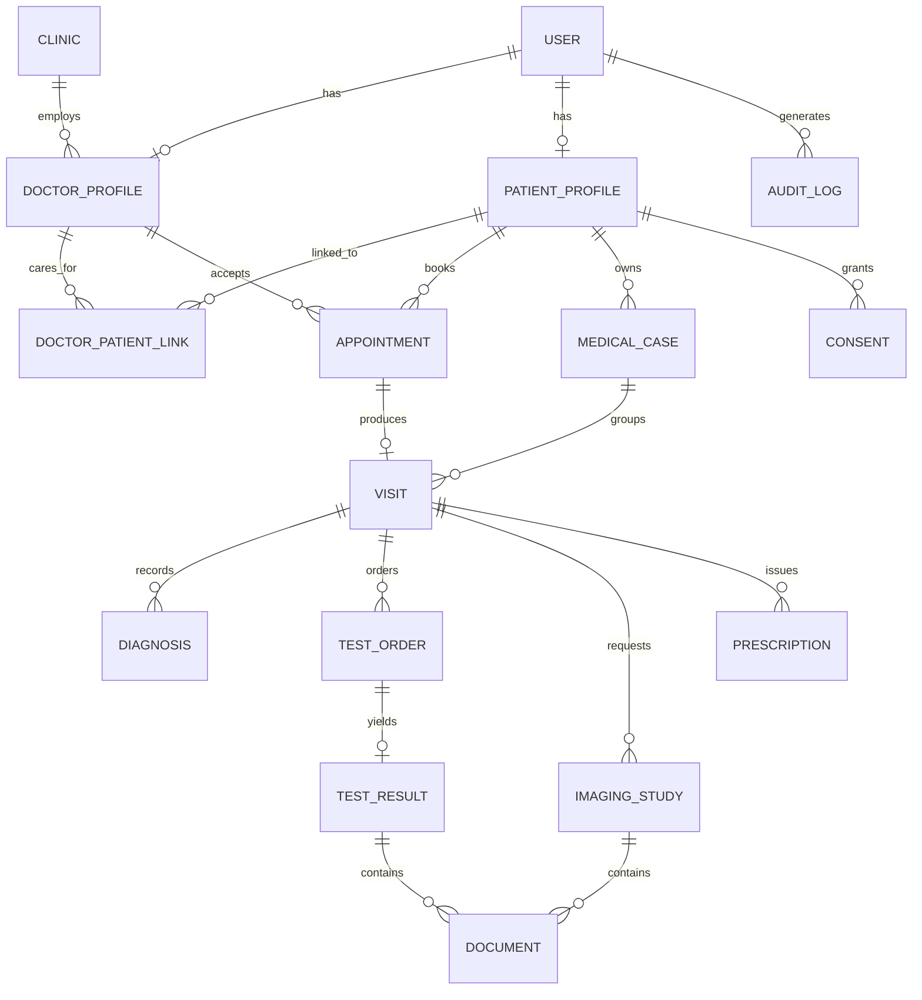
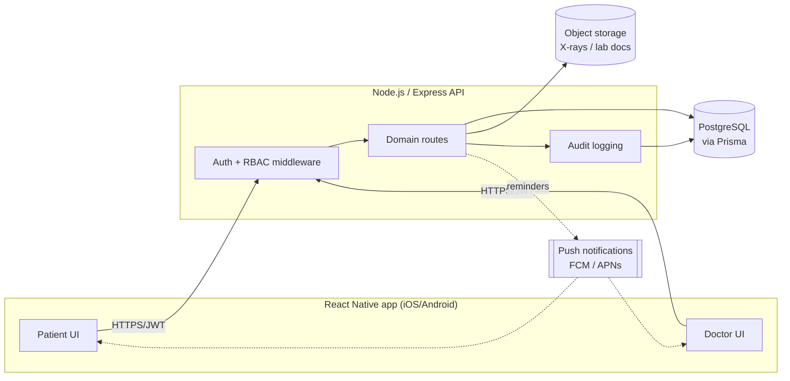

# Clin — Health Clinic Management Platform

Architecture & design for a mobile application that manages health clinics
from both the **doctor** and **patient** side: appointments, per-patient case
history, visits, diagnoses, lab tests, imaging (X-rays), and role-based
security around all of it.

## 1. Actors

| Role | Description |
|---|---|
| **Patient** | Books/manages appointments, views their own case history, visits, diagnoses, test results and imaging, controls who can see their data. |
| **Doctor** | Manages their schedule, sees the patients linked to them, records visits, diagnoses, orders tests/imaging, prescribes. |
| **Clinic Admin** | Manages clinic profile, staff, and scheduling. No clinical data access unless also a doctor. |
| **Super Admin** *(future)* | Platform-level: onboards clinics, manages global config. Out of scope for this scaffold. |

## 2. Domain model

A patient's history is organized as: **Case** (a condition being tracked over
time) → **Visits** (individual encounters, walk-in or from an appointment) →
**Diagnoses** / **Test Orders → Results** / **Imaging Studies** /
**Prescriptions** recorded against that visit. This lets a doctor see either
"everything from this one visit" or "the whole timeline for this condition."



Key tables (full definitions live in `backend/prisma/schema.prisma`):

- **User** — email, phone, `passwordHash`, `role` (`PATIENT` / `DOCTOR` / `CLINIC_ADMIN`), MFA flag, active flag.
- **DoctorProfile** / **PatientProfile** — role-specific data (specialty & license vs. DOB, blood type, allergies, emergency contact).
- **Clinic** — a physical clinic; doctors belong to one (or more, future).
- **DoctorPatientLink** — the care relationship that gates a doctor's access to a patient's records; created when a patient books with / is accepted by a doctor, and revocable by the patient.
- **Appointment** — scheduled slot between patient and doctor; states `REQUESTED → CONFIRMED → COMPLETED / CANCELLED / NO_SHOW`.
- **MedicalCase** — a named condition/episode of care that groups visits over time (e.g. "Recurring migraines, 2026").
- **Visit** — one encounter (from an appointment or a walk-in), with vitals, chief complaint, notes.
- **Diagnosis**, **TestOrder** → **TestResult**, **ImagingStudy** (X-ray/CT/MRI/ultrasound), **Prescription** — all hang off a `Visit` and optionally a `MedicalCase`.
- **Document** — generic file record (S3/local key, mime type, checksum) attached to a `TestResult` or `ImagingStudy`; never a public URL, always served via short-lived signed URLs.
- **Consent** — explicit patient grant of access to a doctor/clinic, with grant/revoke timestamps.
- **AuditLog** — append-only record of every access/mutation of clinical data (actor, action, target, timestamp, IP, and a `reason` field for emergency "break-glass" access).
- **RefreshToken** — hashed, rotated, per-device session record so a user can see and revoke active sessions.

## 3. Security & privacy model

**Authentication**
- Passwords hashed with bcrypt (cost 12). Short-lived JWT access token (15 min) + rotating refresh token, hashed at rest, one per device/session.
- MFA (TOTP) supported on the User model for doctors/admins (flagged as follow-up to implement end-to-end).
- Full-session revocation ("log out everywhere") by invalidating all refresh tokens for a user.

**Authorization (RBAC + relationship-based access)**
- Coarse-grained: middleware gates routes by `role` (`PATIENT`, `DOCTOR`, `CLINIC_ADMIN`).
- Fine-grained, enforced per-request, not just per-role:
  - A patient can only read/write **their own** records.
  - A doctor can only read/write a patient's clinical records if an active `DoctorPatientLink`/`Consent` exists — not just "any doctor can see any patient."
  - Emergency ("break-glass") access outside that link is possible but requires a `reason` and is flagged + audited distinctly.
  - Clinic admins can manage scheduling/staff but are denied clinical-data routes unless they also hold a doctor role.

**Data protection**
- TLS everywhere in transit.
- Imaging/lab files live in object storage behind private ACLs; the API only ever hands out short-lived signed URLs, never permanent public links.
- Sensitive free-text fields (diagnosis notes, allergies) are candidates for application-level AES-256-GCM field encryption keyed via a KMS — the scaffold isolates this behind a `crypto` service so it can be turned on without changing call sites.
- All clinical reads/writes append an `AuditLog` row.

**Input safety**
- All request bodies validated with `zod` schemas before touching the DB.
- Prisma's parameterized queries eliminate SQL injection by construction.
- `helmet` for security headers, strict CORS allow-list, rate limiting + lockout on auth endpoints, and MIME/size validation on uploads.

This is designed to be **compatible** with HIPAA/GDPR-style obligations
(consent tracking, audit trail, data minimization, exportability) — actual
certification needs a real compliance review beyond what a scaffold can
claim.

## 4. High-level architecture



## 5. API surface (REST, `/api/v1`)

```
POST   /auth/register            POST /auth/login        POST /auth/refresh
POST   /auth/logout              GET  /auth/me

GET    /users/me                 PATCH /users/me

GET    /doctors                  GET  /doctors/:id
GET    /doctors/me/patients                      (doctor's linked patients)
GET    /patients/:id                              (self, or linked doctor)

POST   /appointments             GET  /appointments        GET /appointments/:id
PATCH  /appointments/:id                          (confirm/cancel/reschedule)

POST   /visits                   GET  /patients/:id/visits GET /visits/:id

POST   /cases                    GET  /patients/:id/cases  PATCH /cases/:id

POST   /visits/:id/diagnoses     GET  /cases/:id/diagnoses

POST   /visits/:id/test-orders   POST /test-orders/:id/results
GET    /patients/:id/test-results

POST   /imaging  (multipart)     GET  /imaging/:id (signed URL)
GET    /patients/:id/imaging

POST   /visits/:id/prescriptions GET  /patients/:id/prescriptions

POST   /consents                 DELETE /consents/:id

GET    /audit-logs               (admin only)
```

## 6. Mobile UX flows

- **Auth** — role-aware login. Patients self-register; doctor accounts are
  provisioned by a clinic admin, then activated by the doctor.
- **Patient** — Home (next appointment, recent activity) → find a
  doctor/clinic → book appointment → **My Records** (case timeline, visits,
  diagnoses, test results, X-ray gallery with a pinch-zoom viewer) → consent
  manager (see who has access, revoke it).
- **Doctor** — Home (today's schedule) → patient list (linked patients only)
  → patient detail (case timeline; add visit / diagnosis / test order /
  imaging / prescription) → appointment calendar.
- **Shared** — secure document viewer for imaging, push reminders for
  upcoming appointments and "results ready" notifications.

## 7. Tech stack

- **Mobile**: React Native + TypeScript (Expo), React Navigation, `expo-secure-store` for token storage.
- **Backend**: Node.js + TypeScript + Express, Prisma ORM + PostgreSQL, JWT auth, `multer` for uploads behind a storage adapter (local disk in dev, S3-compatible in prod).
- **Infra (future)**: Docker Compose for local Postgres, S3/MinIO for object storage, CI running lint/typecheck/tests.

## 8. What's actually scaffolded here vs. future work

**Scaffolded in this repo:**
- Full Prisma schema for the data model above.
- Backend: auth (register/login/refresh/logout), RBAC + relationship-based
  access middleware, routes/controllers for appointments, patients, visits,
  cases, diagnoses, test orders/results, imaging upload + signed-URL
  retrieval, audit logging.
- Mobile: role-based navigation, auth screens, doctor screens (dashboard,
  patient list/detail, appointments), patient screens (dashboard,
  appointments, book appointment, medical records, imaging viewer), API
  client wired to the backend.

**Explicitly not implemented yet** (flagged rather than half-built):
MFA/TOTP end-to-end, push notifications, real S3 integration (the storage
adapter interface exists; only the local-disk implementation is wired up),
automated test suite, CI pipeline, clinic-admin management UI, production
deployment config, field-level encryption (the `crypto` service seam exists,
encryption itself is not turned on).
